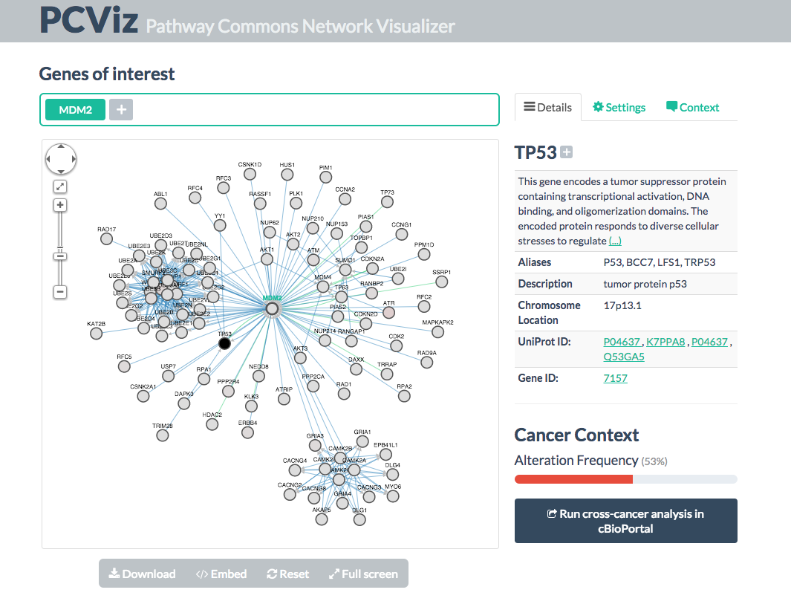

[](https://travis-ci.org/PathwayCommons/pcviz)

# About
[Pathway Commons](http://www.pathwaycommons.org) Simple Network Visualizer, PCViz in short.

[](http://www.pathwaycommons.org/pcviz/)

# Use
Clone the repository and change (cd) in there. 

Copy and edit the configuration file:
```
cp -f src/main/resources/application.properties.example src/main/resources/application.properties
```
The property `hgnc.location` should point to a valid HGNC output that contains the official gene symbols and their synonyms.
This file can be downloaded as follows:
```
wget -O /tmp/hgnc.txt "https://www.genenames.org/cgi-bin/download/custom?col=gd_app_sym&col=gd_aliases&col=md_prot_id&status=Approved&status_opt=2&where=&order_by=gd_hgnc_id&format=text&limit=&hgnc_dbtag=on&submit=submit"
```
The property `ncbigene.location` should point to a valid NCBI (Entrez) Gene output that contains 
the official gene symbols and IDs. This file can be downloaded as follows:
```
wget -O /tmp/ncbigene.txt "https://www.genenames.org/cgi-bin/download/custom?col=gd_app_sym&col=gd_pub_eg_id&status=Approved&status_opt=2&where=&order_by=gd_app_sym_sort&format=text&limit=&hgnc_dbtag=on&submit=submit"
```

Make sure all other properties reflect the options you wanted to set. 

Now, build the java application with maven using the following command:

```
mvn clean package
```

The following command starts the application:
```
java -Xmx16g -jar target/pcviz*.jar
```
or
```
mvn spring-boot:run
```

and then point your browser to [http://localhost:8080/](http://localhost:8080/).


# Pre-populate cache (optional)
To serve networks better, PCViz can utilize cached network data.
The data folder for the cache files is set within the properties file using the

*TODO:* it won't cache co-citations due to iHope service is discontinued (we're still looking for other options)

To prepare those caches, you need to

1. Clean up your `cache.folder`
2. Deploy a dummy PCViz with empty caches
3. Edit `uniprot_scraper.js` to point to the non-cached version of PCViz (if it is different than the production one)
4. Make sure `phantomjs` is installed and run `uniprot_scraper.sh` with these arguments: 
`bash uniprot_scraper.sh /path/to/hgnc.txt /path/to/cache log.txt`
5. Move all the JSONs over to your `cache.folder/networks/` directory
6. Restart/re-deploy PCViz with this cache folder populated

It is a good idea to clean up other cache folders (such as portal and co-citations) once in a while, 
but it is not required unless the formatting changes for those files/services. 
Only the pre-calculated network cache requires pre-processing.
